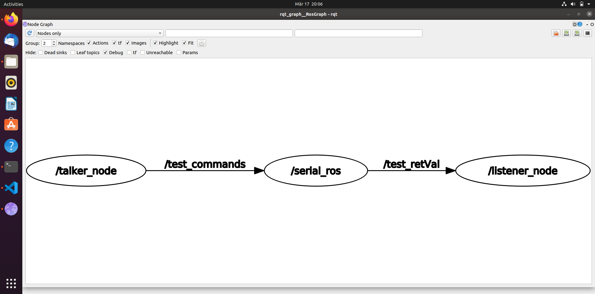

## Create catkin WS, ROS pkg and laucnh file

This readme will help you create:

* catkin workspace
* create a ros package 
* create a launch file

# catkin workspace
~~~bash
$ mkdir -p ~/catkin_ws/src
$ cd ~/catkin_ws/
$ catkin_make
$ source devel/setup.bash
#or for permanent use
$ echo "source ~/catkin_ws/devel/setup.bash">>~/.bashrc
~~~
# ros package
~~~bash
#create a test pkg followed by dependencies
catkin_create_pkg test_pkg rospy roscpp std_msgs rosserial_arduino  rosserial_client   rosserial_msgs     rosserial_python
~~~
copy folder [test_pkg](catkin_ws/src/test_pkg/scripts) folder following the same path to your package.

# launch file
copy [launch](catkin_ws/src/test_pkg/launch) folder following the same path to your package.
~~~bash 
roslaunch test_pkg test.launch 
~~~

## BONUS: rqt_graph

